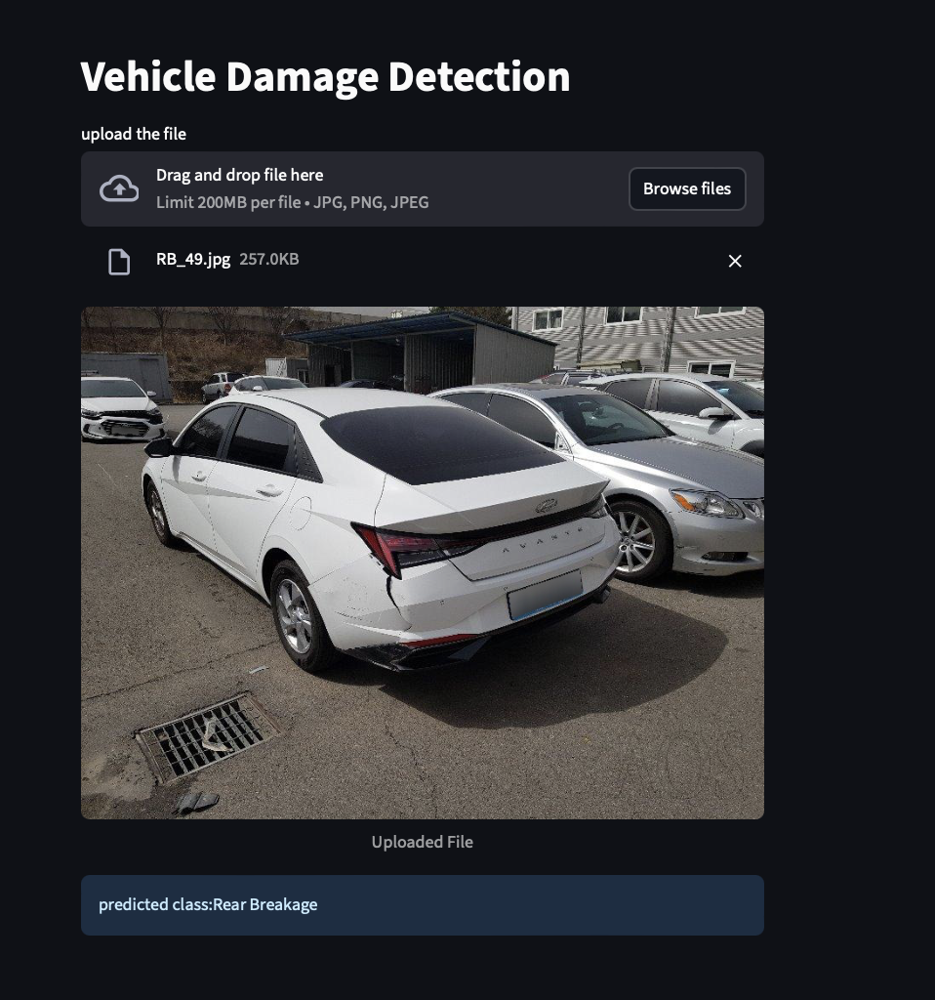

# 🚗 Car Damage Detection

[](https://www.python.org/)
[](https://pytorch.org/)
[](https://streamlit.io/)
[](LICENSE)

An interactive **AI-powered web app** that detects car damage from images.  
Just drag & drop a photo of your car’s **front** or **rear** view — the model will classify the damage type instantly.

---

## 📸 App Preview


---

## 📊 Model Details

- **Architecture**: ResNet50 (Transfer Learning)
- **Training Data**: ~1700 labeled images
- **Target Classes**:
  1. Front Normal
  2. Front Crushed
  3. Front Breakage
  4. Rear Normal
  5. Rear Crushed
  6. Rear Breakage
- **Validation Accuracy**: ~80%
- **Note**: Works best with images taken from the **front** or **rear** of the car.

---

## 🛠 Tech Stack
- **Python**
- **PyTorch**
- **Torchvision**
- **Pillow**
- **Streamlit**

---

## ⚙️ Installation & Setup

1. **Clone the repository**:
   ```bash
   git clone https://github.com/yourusername/car-damage-detection.git
   cd car-damage-detection

2.  Install the dependencies:
    ```commandline
     pip install -r requirements.txt
    ```
   
3. Run the streamlit app:
   ```commandline
   streamlit run app.py